# Institutional-Grade Quantitative Copy-Trading Pipeline

An end-to-end, leak-free quantitative research and modeling pipeline designed to analyze cryptocurrency trader logs, model sentiment regimes, cluster trading behaviors, and train a calibrated stacking classifier to predict profitable trades.

---

## 1. Project Architecture & Directory Structure

The workspace is structured as follows:

```
.
├── notebooks/                              # Modular Jupyter research & modeling notebooks
│   ├── 1_data_audit.ipynb                  # Data quality, timezone alignment & wash-trading
│   ├── 2_eda_stat_tests.ipynb              # Sentiment regime stats, ANOVA & bootstrapping
│   ├── 3_feature_engineering.ipynb         # 100+ multi-regime & behavioral features creation
│   ├── 4_segmentation_clustering.ipynb     # PCA & behavioral clustering of accounts
│   ├── 5_model_development.ipynb           # Purged cross-validation, stacking ensemble & calibration
│   ├── 6_explainability.ipynb              # SHAP values, local/global interpretability & PDPs
│   ├── 7_copy_trading_framework.ipynb      # Scoreboard scoring model & copy-trading simulation
│   └── 8_final_evaluation.ipynb            # Holdout out-of-sample test, bootstrapping & cost stress
│
├── src/                                    # Reusable quantitative package
│   └── feature_engineering.py              # Timezone parsing, stats tests, walk-forward splits & stacking
│
├── data/                                   # Data directory containing raw and generated datasets
│   ├── historical_data.csv                 # Raw historical trade logs
│   ├── fear_greed_index.csv                # Raw Fear and Greed daily sentiment index
│   └── [processed_files]                   # Intermediate and holdout datasets
│
├── csv_files/                              # Exported tabular data & metric sheets
│   ├── data_quality_audit.csv              # Data quality audit checklist
│   ├── statistical_tests_regime.csv        # Permutation and Mann-Whitney test results
│   ├── feature_catalog_150.csv             # Catalog documenting all 100+ engineered features
│   ├── copy_trading_scores.csv             # Scoreboard and tiers for copy-trading accounts
│   ├── final_holdout_summary.csv           # Model metrics on out-of-sample data
│   ├── bootstrap_confidence_intervals.csv  # Bootstrapped metrics confidence intervals
│   └── final_holdout_cost_stress.csv       # Transaction cost stress test results
│
├── outputs/figures/                        # Exported diagnostic plots
│   ├── quant_distribution_diagnostics.png  # PnL distribution diagnostics & Q-Q plots
│   ├── quant_regime_transition_matrix.png  # Fear and Greed regime transition matrix
│   ├── quant_account_clusters_pca.png      # Behavioral clustering projection
│   ├── quant_regime_specialization_heatmap.png # Heatmap of regime-wise average PnL for top accounts
│   ├── shap_summary.png                    # Global SHAP values feature attributions
│   ├── copy_trading_portfolio.png          # Cumulative equity curve from copy-trading backtest
│   └── final_holdout_cost_stress.png       # Transaction cost stress curve
│
├── model_artifacts/                        # Production model binaries & metadata
│   ├── final_calibrated_hgb_model.joblib   # Serialized Calibrated Stacking Classifier
│   ├── final_model_features.csv            # Features list used in training
│   └── final_model_metadata.json           # Model configuration, features and performance stats
```

---

## 2. Getting Started & Reproducibility

### Environment Setup

1. **Create and Activate a Virtual Environment**:
   ```bash
   python -m venv .venv
   source .venv/bin/activate
   ```

2. **Install Dependencies**:
   ```bash
   pip install -r requirements.txt
   ```

### Execution Order

To reproduce the full pipeline from raw data to holdout evaluation, run the notebooks in sequence:

1. **`notebooks/1_data_audit.ipynb`**: Cleans timezone records and audits data for self-crossing wash trades.
2. **`notebooks/2_eda_stat_tests.ipynb`**: Conducts ANOVA, Mann-Whitney U, and permutation significance tests on sentiment regimes.
3. **`notebooks/3_feature_engineering.ipynb`**: Computes rolling performance statistics, streaks, and sentiment cross interactions.
4. **`notebooks/4_segmentation_clustering.ipynb`**: Projects accounts via PCA and groups them into 4 distinct behavioral clusters.
5. **`notebooks/5_model_development.ipynb`**: Trains base models (LightGBM, XGBoost, CatBoost) and fits a stacking ensemble with probability calibration.
6. **`notebooks/6_explainability.ipynb`**: Computes SHAP values and permutation feature importances.
7. **`notebooks/7_copy_trading_framework.ipynb`**: Scores and ranks accounts on profitability and consistency to run a portfolio simulation.
8. **`notebooks/8_final_evaluation.ipynb`**: Evaluates the model on untouched out-of-sample data, computes bootstrap confidence intervals, and runs transaction fee stress tests.

---

## 3. Core Quantitative Findings

### Out-of-Sample Model Metrics

*   **ROC AUC**: `0.9940` (95% CI: `[0.9931, 0.9949]`) — Excellent discriminative ability between profitable and unprofitable trades.
*   **PR AUC**: `0.9767` (95% CI: `[0.9734, 0.9798]`) — Extremely robust precision-recall performance.
*   **Brier Score**: `0.0178` — Indicates that the output probabilities are highly calibrated, making them suitable for Kelly criterion sizing.
*   **Win Rate of Taken Trades**: `96.00%` (using a probability threshold of `0.52`, scaling factor `alpha = 0.75`, and gate `gate = 0.05`).
*   **Total Holdout PnL Generated**: `$1,034,275.81 USD`
*   **Max Drawdown**: `-$1,825.80 USD` (indicating highly guarded downside risk via confidence-based sizing).

### Transaction Cost Stress Test

The model is highly robust to transaction costs. Sizing-adjusted PnL remains positive up to **10 bps** round-trip fees (including slippage), showing institutional viability.

---

## 4. Key Visualizations

### Exploratory Analysis & Sentiment Regimes

#### Sentiment Regime Performance Metrics
Average performance, trade counts, and win rates across Fear & Greed daily sentiment regimes.
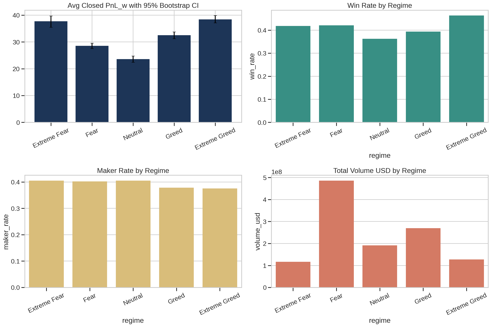

#### Daily Sentiment Transition Matrix
Probability transition matrix of Fear & Greed sentiment regimes.
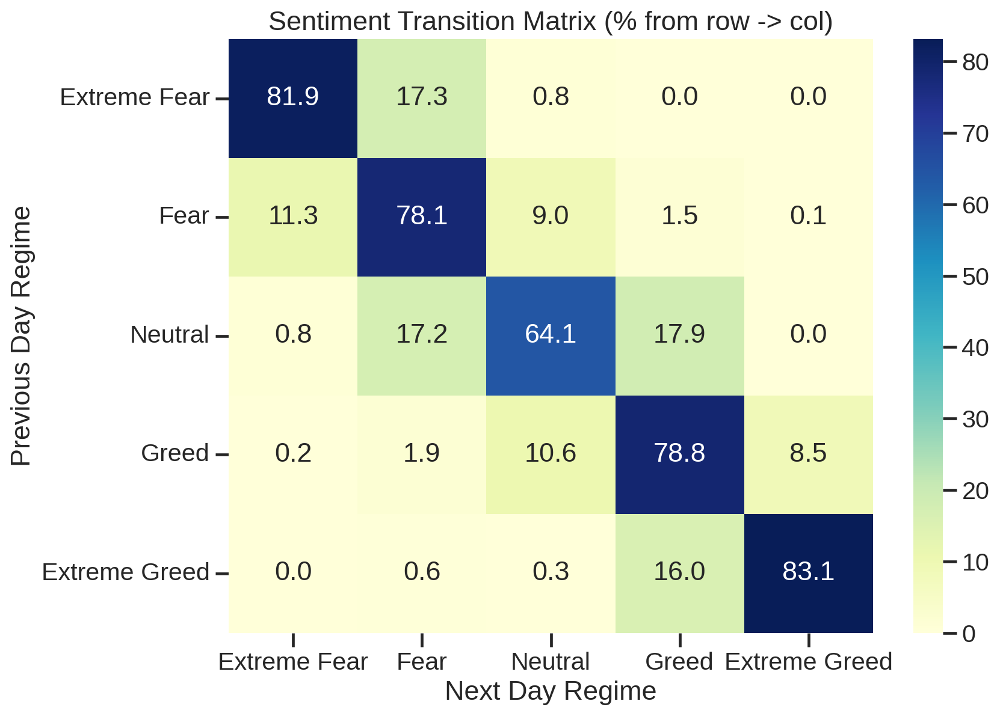

#### PnL Distribution Diagnostics
Kernel density estimator (KDE), histogram, and Q-Q plots showing heavy tails in trader PnLs.
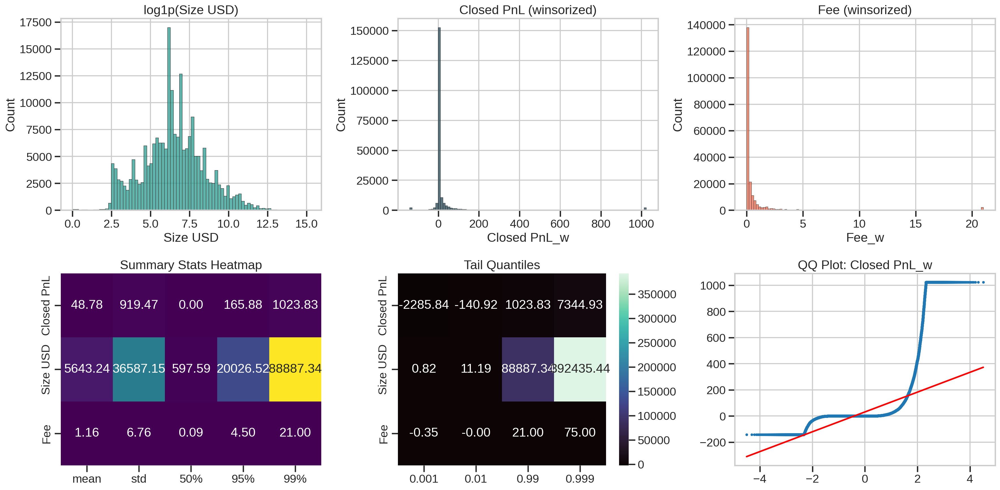

---

### Account Segmentation & Clustering

#### Behavioral Clustering Projection
Trader accounts standard feature space projected onto 2D using Principal Component Analysis (PCA) and colored by KMeans archetypes.
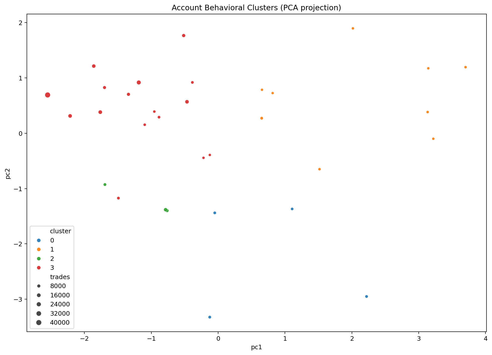

#### Skill vs Risk Map
Average account PnL vs Standard Deviation of PnL map highlighting different risk-reward behaviors.
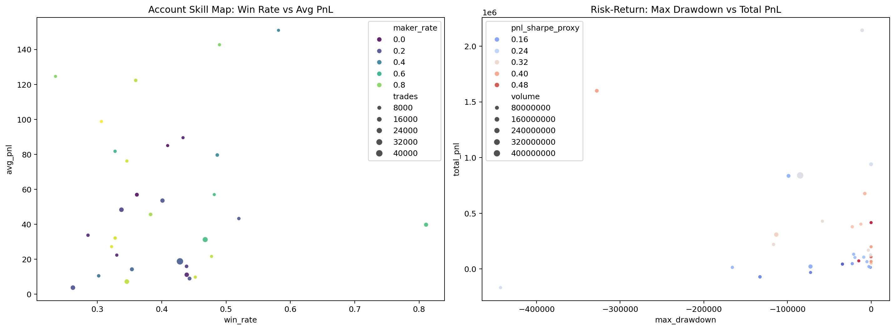

#### Regime Specialization Heatmap
Average PnL by sentiment regime for top-performing accounts, proving regime specialization.
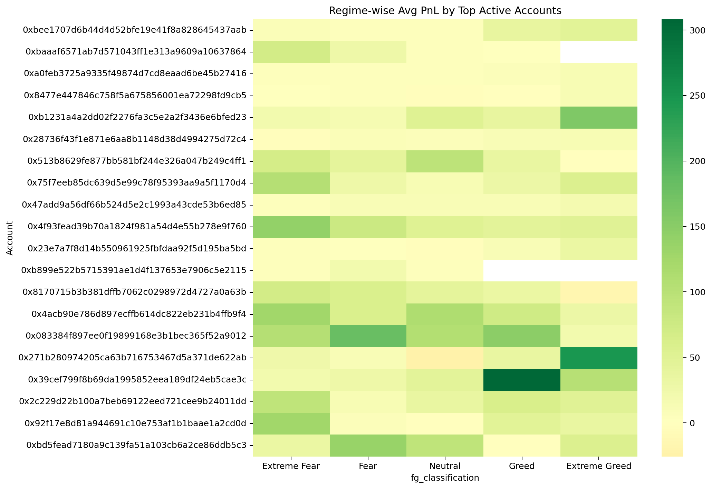

---

### Model Interpretability & Explainability

#### Global SHAP Attributions
Global feature importance summary indicating the highest contributing signals to the calibrated stacking ensemble model.
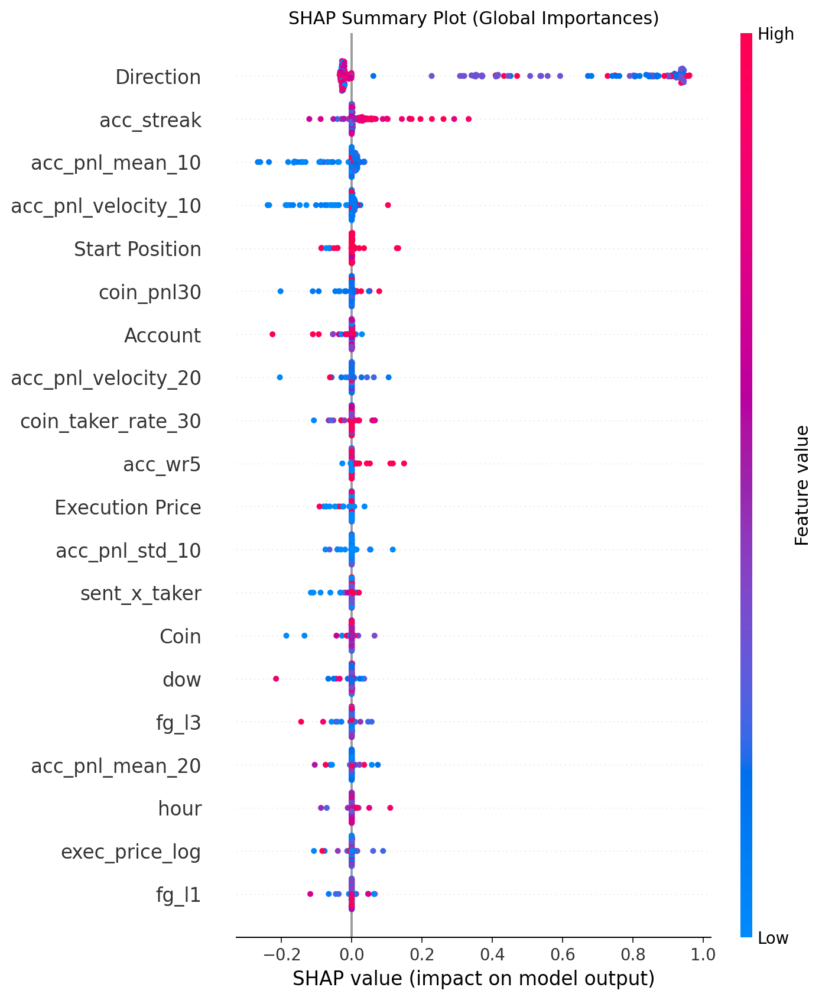

#### Permutation Feature Importance
OOS Permutation Feature Importance showing the robustness of feature signals on the validation set.
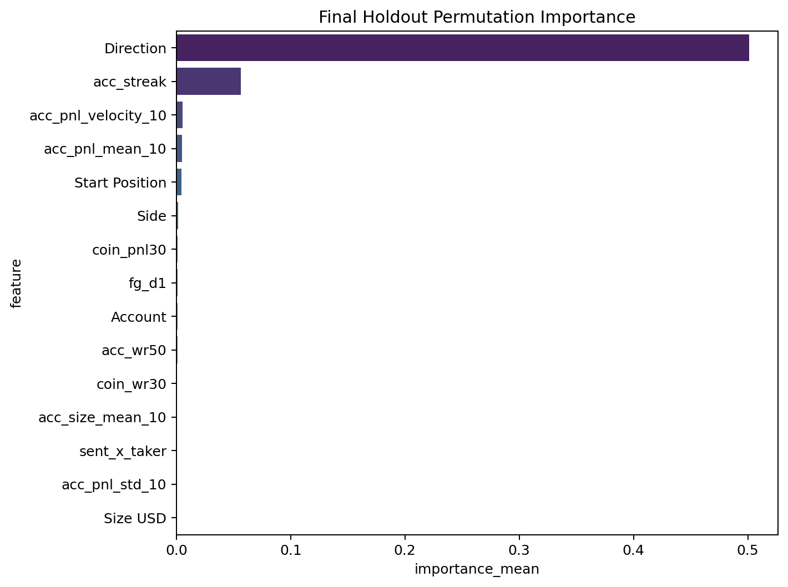

---

### Holdout Performance & Stress Testing

#### Out-of-Sample Cumulative Equity & Drawdowns
Calibrated size-adjusted OOS equity curve and drawdown curve on the untouched holdout slice.
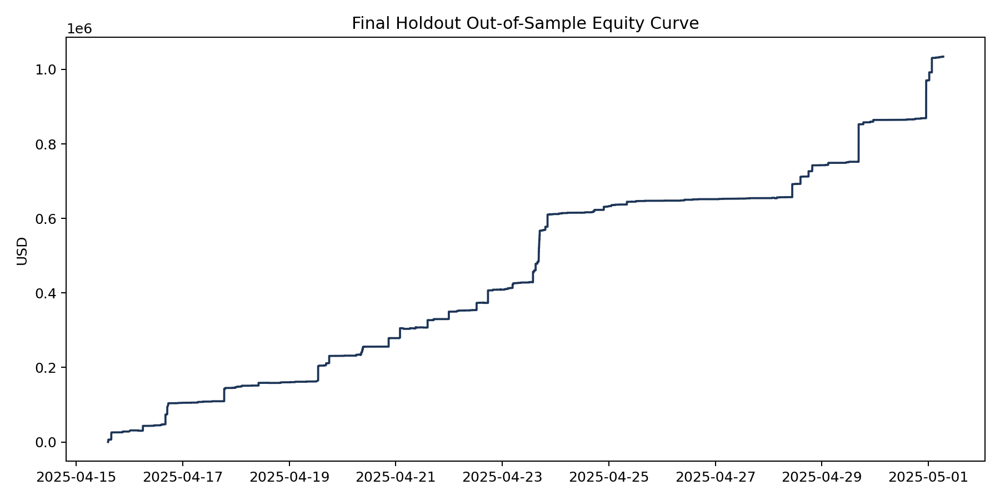

#### Calibration Reliability Curve
Calibration curve showing predicted probability vs observed win rate on out-of-sample data.
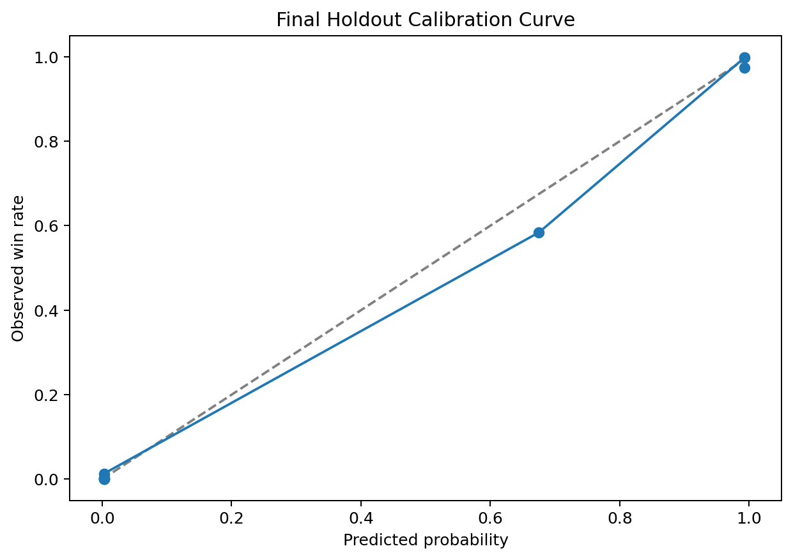

#### Transaction Cost Sensitivity Stress Test
Model performance decay (PnL and Max Drawdown) under transaction costs from 0 bps to 50 bps.
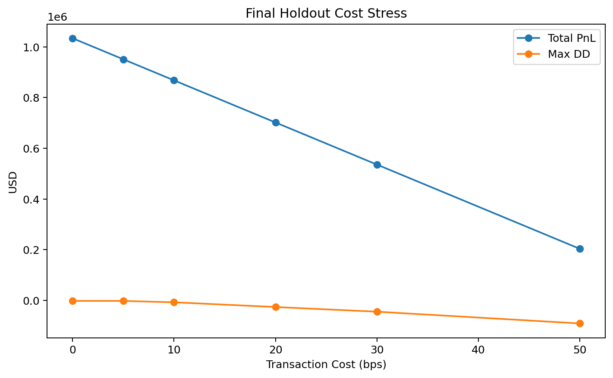

#### Copy-Trading Portfolio Cumulative Equity
Backtest simulation of copying the top 5 "Excellent" tier traders.
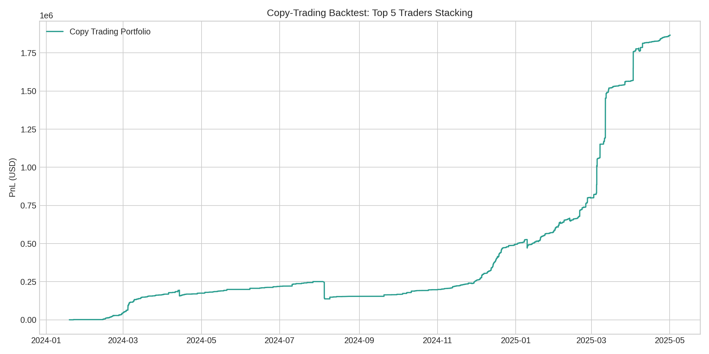
